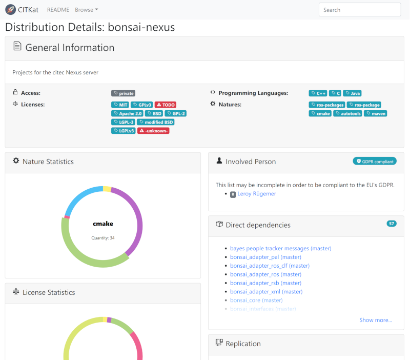

.. _advanced:

Advanced
========

.. _deployment-modes:

Deployment Modes
-----------------------

Users can choose different deploy modes in |project|:

toolkit

    Used to generate build jobs which bootstrap a complete software
    distribution from scratch by installing it into a filesystem
    location. The generated Jenkins_ jobs are triggered in the
    appropriate order by an additional orchestration job -- no SCM
    polling is performed in this mode.

ci-deploy

    This mode is used to automatically update a software distribution
    installed in a filesystem location after each SCM change to any of
    the involved :term:`projects <project>`. An additional
    orchestration job performs the initial build in an order that
    respects dependencies between :term:`projects <project>`.

ci

    Continuous integration mode for continuously building and testing
    software without installing into a filesystem location. Artifacts
    are copied between build job workspaces to handle dependencies
    between :term:`projects <project>`.

Makefile

    TODO

Docker

    TODO

Private Repository
------------------

.. note::

    The best way to access private git repositories is accessing them with ssh keys. To enable ssh access for git repositories the project URL scheme has to be ``git+ssh``.

    Example for GitHub projects: :samp:`git+ssh://github.com/{USER}/{PROJECT}.git`

Password based access
~~~~~~~~~~~~~~~~~~~~~

In cases where access to a repository only possible with password restricted access, :program:`build-generator` and Jenkins need to know the login credentials.

.. note::

    If you are using GitHub for example, you can generate an `access token <https://github.com/settings/tokens>`_ with read-only access to your repository by ticking ``repo -> public_repo`` and then use this token as password along with your GitHub login name.

:program:`build-generator` requires you to store your credentials **unecrypted** in a file called :file:`~/.netrc`, using the following syntax for every remote machine your distribution is referencing:

.. code-block:: perl

    machine projects.cit-ec.uni-bielefeld.de
        login your_user_name
        password secret_api_token_OR_plain_password

Jenkins credentials store
~~~~~~~~~~~~~~~~~~~~~~~~~

After generating a distribution with private access projects, :program:`build-generator` shows the required credentials:

.. parsed-literal::

    The following credentials have been referenced and have to be configured in Jenkins' credential store:
    * ":samp:`{CREDENTIAL_ID}`" for jobs ...
    * ":samp:`{CREDENTIAL_ID}`" for job ...

The given :samp:`{CREDENTIAL_ID}s` need to be added to the Jenkins credential store jenkins_credentials_.

.. _jenkins_credentials: https://jenkins.io/doc/book/using/using-credentials/

Speed up generator analyze (Caching)
------------------------------------

:program:`build-generator` is using ``git ls-remote`` a lot. When
generating often, this process can take up much time. It is
then recommended to enable caching, try
:option:`cache-directory <build-generator --cache-directory>`
and  :option:`cache-age-limit <build-generator --cache-age-limit>`.

.. _web-catalog:

Generate Catalog Representation
-------------------------------

|project| includes a human readable representation of data generated from recipes and source code.

You can use :program:`build-generator` to emit these catalog-like pages:

.. code-block:: bash

    export OUTPUT_DIR="$HOME/catalog"
    export DISTRIBUTION="$RDTK_ROOT/citk/distribution/example-*.distribution"
    $RDTK_ROOT/build-generator report -k catalog -o "$OUTPUT_DIR" "$DISTRIBUTION"

Install the catalog server:

.. code-block:: bash

    git clone https://github.com/RDTK/CITKat.git; cd CITKat
    ./setup install --user

Run the catalog server:

.. code-block:: bash

    export PATH=$HOME/.local/bin:$PATH
    cd "$OUTPUT_DIR"
    citkat

Point your browser to http://localhost:5000/.

If you'd like to learn how to set up a production environment, have a look at the `README <https://github.com/RDTK/CITKat#readme>`_.

.. Then use your browser to open the ``.xml`` files:

.. .. code-block:: bash

..     xdg-open "$OUTPUT_DIR/distribution/*.xml"

Include Distributions
---------------------
